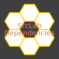

#  SrcLab Dependencies: Dependencies Management for [SrcLab]

<span id="author" class="author">Sun Qian</span>
<span id="email" class="email"><fredsuvn@163.com></span>

## Introduction

`srclab-dependencies` is a dependency management for [SrcLab] projects, provides version management for common third
party libs, as the role of `dependencyManagement` in Maven.

## Getting

### Gradle

```groovy
api platform("xyz.srclab.dependencies:srclab-dependencies:0.0.1")
```

### Maven

```xml

<dependencies>
  <dependency>
    <groupId>xyz.srclab.dependencies</groupId>
    <artifactId>srclab-dependencies</artifactId>
    <version>0.0.1</version>
    <type>pom</type>
    <scope>import</scope>
  </dependency>
</dependencies>
```

### Source Code

[Source]

## Contribution and Contact

* fredsuvn@163.com
* [Source]
* QQ group: 1037555759

## License

[Apache 2.0 license][license]

[SrcLab]: https://github.com/srclab-projects

[Source]: https://github.com/srclab-projects/srclab-dependencies

[license]: https://www.apache.org/licenses/LICENSE-2.0.html